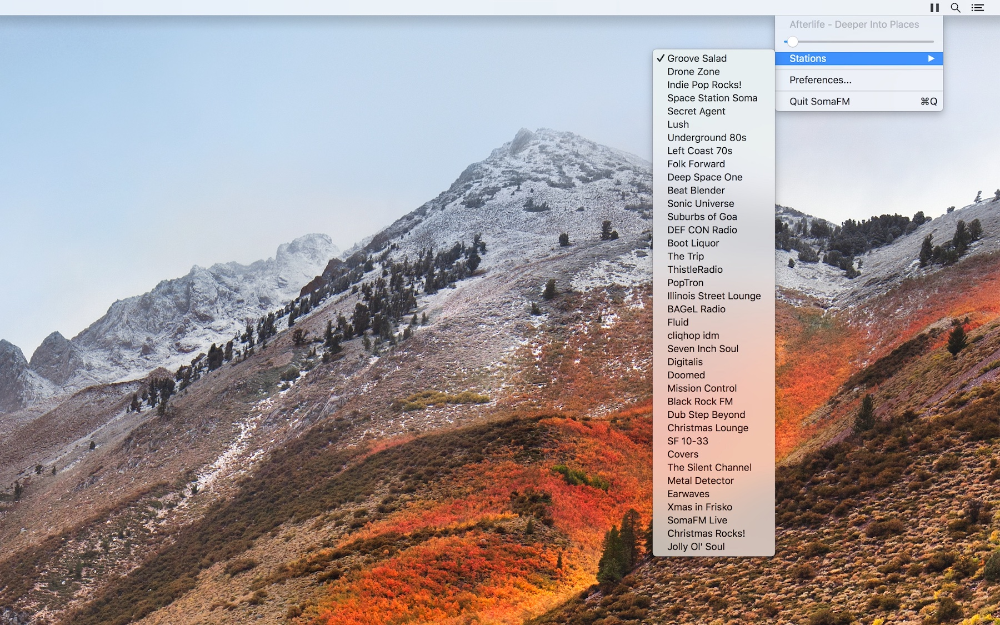

# SomaFM miniplayer

This is unofficial player that gives you minimal, background playback of SomaFM channels.

## Author

Created and maintained by Evgeny Aleksandrov ([@ealeksandrov](https://twitter.com/ealeksandrov)).

## License

`SomaFM miniplayer` is available under the MIT license. See the [LICENSE.md](LICENSE.md) file for more info.
