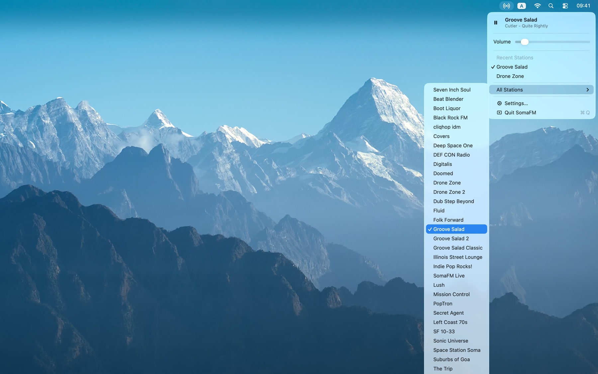

# SomaFM miniplayer

An unofficial, minimal menu-bar player for [SomaFM](https://somafm.com/).

## Installation

- Install the sandboxed app from the [Mac App Store](https://itunes.apple.com/us/app/somafm-miniplayer/id1303140142?mt=12&at=1000lHGx).
- Or download the signed and notarized app from [GitHub Releases](https://github.com/ealeksandrov/SomaFM-miniplayer/releases/latest).

## Usage

- Left-click the status item to play or pause.
- Right-click, Control-click, or Option-click to open the menu.
- Click the current track to copy it or search with the action selected in Settings.
- Settings controls launch playback, notifications, station sorting, recent stations, the track action, and Start at Login.

## Building

Open `SomaFM.xcodeproj` in Xcode 26 or later and run the `SomaFM` scheme. The project has no third-party dependencies or bootstrap step.

## Author

Created and maintained by Evgeny Aleksandrov ([@ealeksandrov](https://twitter.com/ealeksandrov)).

## License

SomaFM miniplayer is available under the MIT license. See [LICENSE.md](LICENSE.md).
